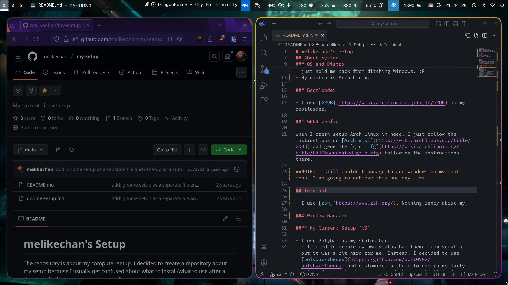
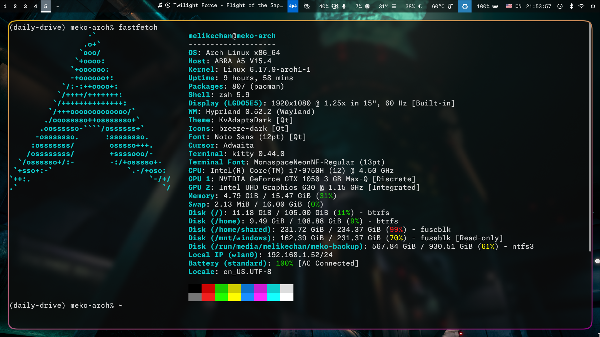
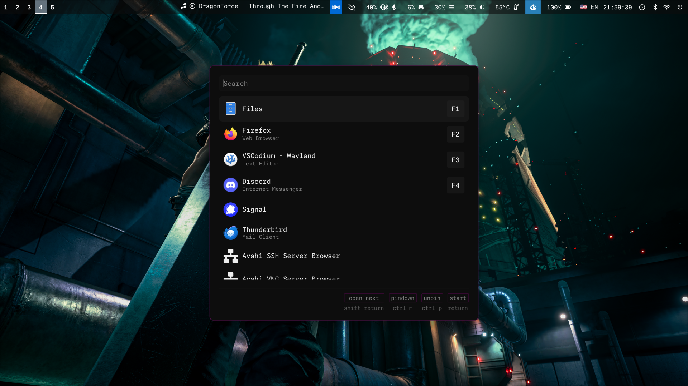

# melikechan's Setup

The repository that contains my setup.

I decided to create a repository about my setup because I usually get confused about what to install / what to use after a clear installation, so better to create a list about it.

## Screenshots

<div align="center">
  
  <p>Two tabs are open alongside</p>
</div>

<div align="center">
  
  <p>Desktop</p>
</div>

<div align="center">
  
  <p>fastfetch output on kitty</p>
</div>

<div align="center">
  
  <p>Menu (Walker)</p>
</div>

## About System

### OS and Distro

- I use Linux alongside Windows 11.
  - To be honest, **I hate using Windows 11 (tbh, Windows at all)**, but Adobe apps just hold me back from ditching Windows. :P
- My distro is **Arch Linux**.

### Bootloader

- I use [GRUB](https://wiki.archlinux.org/title/GRUB) as my bootloader.

### GRUB Config

When I fresh setup Arch Linux in need, I just follow the instructions on [Arch Wiki](https://wiki.archlinux.org/title/GRUB) and generate [grub.cfg](https://wiki.archlinux.org/title/GRUB#Generated_grub.cfg) following the instructions there.

**NOTE: I still couldn't manage to add Windows on my boot menu. I am going to achieve this one day...**

### Disk Layout

- My laptop has two NVMe SSDs.
  - In one, I have Linux and in the other, Windows 11.
  - There is a _shared space_ on my second NVMe, which both Linux and Windows benefit from.

Here is my disk layout:

```plain
NAME        FSTYPE MOUNTPOINTS
nvme0n1
├─nvme0n1p1 vfat   /boot
├─nvme0n1p2 swap   [SWAP]
├─nvme0n1p3 btrfs  /
└─nvme0n1p4 btrfs  /home
nvme1n1
├─nvme1n1p1 ntfs   /home/shared
├─nvme1n1p2 # Windows Reserved
└─nvme1n1p3 ntfs   /mnt/windows
```

> [!WARNING]
> I still haven't set Timeshift up.

### Services

- I use [systemd](https://wiki.archlinux.org/title/Systemd), nothing fancy about it lol.

### Networking

- I use [NetworkManager](https://wiki.archlinux.org/title/NetworkManager) with [iwd](https://wiki.archlinux.org/title/Iwd) backend.
  - For user interface, i use [nmtui](https://man.archlinux.org/man/nmtui.1).
- For bluetooth, I just followed the instructions from [the corresponding Arch Linux wiki page](https://wiki.archlinux.org/title/Bluetooth).
  - For user interface, I use [bluetuith](https://github.com/bluetuith-org/bluetuith).

### Audio

- I installed [PipeWire](https://wiki.archlinux.org/title/PipeWire) and [pipewire-pulse](https://docs.pipewire.org/page_man_pipewire-pulse_1.html).
  - As mixer GUI, I use [pavucontrol](https://freedesktop.org/software/pulseaudio/pavucontrol/).

> [!WARNING]
> I **don't remember exactly how I have managed audio.**

### AUR Helper

I use [paru](https://github.com/Morganamilo/paru) as AUR helper.

## Terminal

- I use [zsh](https://www.zsh.org/) as shell. Nothing fancy about my theming.
- I use [kitty](https://sw.kovidgoyal.net/kitty/) as my terminal emulator.

> [!NOTE]
> You can find about config files in the [dotfiles](#dotfiles) section.

## Graphical Interface

### Window Manager

I use [hyprland](https://hypr.land/). It looks really nice.

#### hyprland setup

- [Waybar](https://waybar.org/) as bar.
  - It was a bit tedious to find the handy setup. ~~Yet, it still needs work I guess.~~
  <div align="center">
    
    <p>Waybar</p>
  </div>
- [Walker](https://github.com/abenz1267/walker/) as application launcher.
  - Looks neat. You need to run [elephant](https://github.com/abenz1267/elephant) beforehand.
  - I start Walker with:

  ```sh
  walker --gapplication-service
  ```

- There are some custom entries in my hyprland.conf to **enforce dark theme**. (via this [Reddit post](https://www.reddit.com/r/hyprland/comments/1h4abmt))

```conf
exec = gsettings set org.gnome.desktop.interface color-scheme "prefer-dark"   # for GTK4 apps
exec = gsettings set org.gnome.desktop.interface gtk-theme "adw-gtk3-dark"   # for GTK3 apps
env = QT_QPA_PLATFORMTHEME,qt6ct   # for Qt apps
```

- As dialog provider, I use [zenith](https://gitlab.gnome.org/GNOME/zenity).
- As login manager daemon, I use [greetd](https://wiki.archlinux.org/title/Greetd).
  - As greeter, I use [ReGreet](https://github.com/rharish101/ReGreet).
- As file manager, I use [Nautilus](https://apps.gnome.org/Nautilus/).
- As process tracker, I use [htop](https://htop.dev/).
- As screenshot software, I use [Gradia](https://github.com/AlexanderVanhee/Gradia).

> [!NOTE]
> You can find about config files in the [dotfiles](#dotfiles) section.

### Miscellaneous

#### Web-related

- As browser, I use ~~[Firefox](https://www.firefox.com)~~ [Zen Browser]().
- As mailbox, I use [Thunderbird](https://www.thunderbird.net).

> [!WARNING]
> After Mozilla's [messed up situation](https://archive.is/75FjT), I quit using Firefox.

##### Instant Messaging

- I use [Vesktop](https://github.com/Vencord/Vesktop) as Discord client.
- I use [Signal's official app](https://archlinux.org/packages/extra/x86_64/signal-desktop/) as Signal client.

#### Multimedia

- As image viewer, I use [Loupe](https://apps.gnome.org/Loupe/).
- As media player, I use [VLC Media Player](https://www.videolan.org/).

#### Torrenting

- As torrent client, I use [qbittorrent](https://www.qbittorrent.org/).

##### Media Server

I, personally don't host any media servers (yet). <br />
However, I use one of my friend's Audiobookshelf instance since he let me listen. :)

#### Other

- As keyring, I use [gnome-keyring](https://wiki.archlinux.org/title/GNOME/Keyring).
- As system info fetcher, I use [fastfetch](https://github.com/fastfetch-cli/fastfetch).

## Coding

### Code Editor

I use [VSCodium](https://vscodium.com/) as my code editor.
<br />
As color theme, I use _[One Dark Pro](https://github.com/Binaryify/OneDark-Pro) Night Flat_ and as icon theme, I use _[vscode-icons](https://github.com/vscode-icons/vscode-icons)_.

> [!NOTE]
> _I also have [neovim](https://neovim.io/) installed. However, **I use VSCodium as my on to go one**._

### Language-specific

#### Python

- As environment manager, I use [miniconda](https://www.anaconda.com/docs/getting-started/miniconda/main).
- As package manager, I use [uv](https://github.com/astral-sh/uv).
- As linter & code formatter, I use [ruff](https://github.com/astral-sh/ruff).

> [!TIP]
> You don't need to use uv and miniconda alongside. I use them alongside because of ~~my skill issue~~ lol.

#### C++

_It seems like there isn't anything I can write for now._

#### Rust

_It seems like there isn't anything I can write for now. ~~And, I need to learn Rust first.~~_

## Dotfiles

Came for config files? Sure.

You can find the corresponding dotfiles from my [dotfiles repository](https://github.com/melikechan/dotfiles).

Or... You already came from there. ¯\\_(ツ)\_/¯
